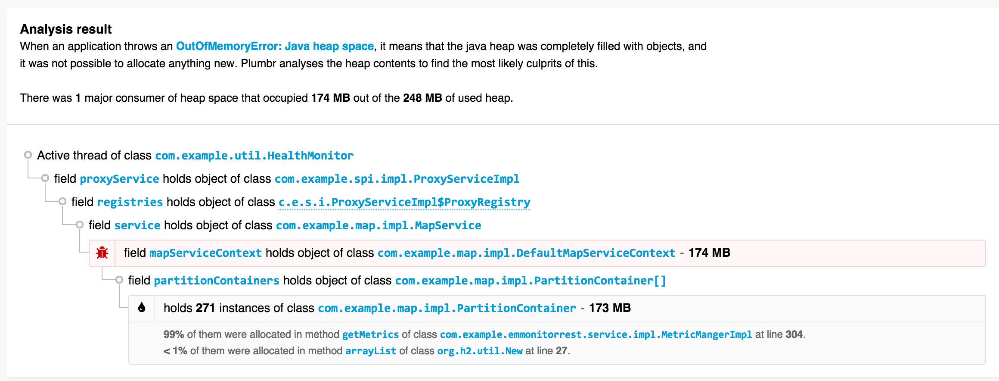

# OutOfMemoryError系列（2）: GC overhead limit exceeded


Java runtime environment contains a built-in [Garbage Collection (GC)](https://plumbr.eu/handbook/what-is-garbage-collection) process. In many other programming languages, the developers need to manually allocate and free memory regions so that the freed memory can be reused.

Java运行时环境内置了 [垃圾收集(GC)](http://blog.csdn.net/renfufei/article/details/53432995) 模块. 在没有自动内存回收的编程语言中, 程序员需要手动分配和释放内存, 以重复利用堆内存。


Java applications on the other hand only need to allocate memory. Whenever a particular space in memory is no longer used, a separate process called [Garbage Collection](https://plumbr.eu/handbook/garbage-collection-in-jvm) clears the memory for them. How the GC detects that a particular part of memory is explained in more detail in the [Garbage Collection Handbook](https://plumbr.eu/java-garbage-collection-handbook), but you can trust the GC to do its job well.

换句话说, 在Java中你只需要分配内存就行。 如果某块内存不再使用, 就会被[垃圾收集(Garbage Collection)](http://blog.csdn.net/renfufei/article/details/54144385) 模块自动清理。GC的详细原理请参考 [GC性能优化](http://blog.csdn.net/column/details/14851.html), 请相信,JVM内置的垃圾收集器能够应对绝大多数的情形。


The _java.lang.OutOfMemoryError: GC overhead limit exceeded_ error is displayed when **your application has exhausted pretty much all the available memory and GC has repeatedly failed to clean it**.

_java.lang.OutOfMemoryError: GC overhead limit exceeded_ 这种情况发生的原因是, **应用程序基本上耗尽了所有可用内存, GC也清理不了**。


## What is causing it?

## 原因分析


The _java.lang.OutOfMemoryError: GC overhead limit exceeded_ error is the JVM’s way of signalling that your application spends too much time doing garbage collection with too little result. By default the JVM is configured to throw this error if it spends more than **98% of the total time doing GC and when after the GC only less than 2% of the heap is recovered**.

_java.lang.OutOfMemoryError: GC overhead limit exceeded_ 是JVM发出了这样的信号: 执行垃圾收集的时间比例太大, 有效的运算量太小. 默认情况下, 如果GC花费的时间超过 **98%**, 并且GC回收的内存少于 **2%**, JVM就会抛出这个错误。


What would happen if this GC overhead limit would not exist? Note that the _java.lang.OutOfMemoryError: GC overhead limit exceeded_ error is only thrown when 2% of the memory is freed after several [GC cycles](https://plumbr.eu/handbook/garbage-collection-algorithms-implementations). This means that the small amount of heap the GC is able to clean will likely be quickly filled again, forcing the GC to restart the cleaning process again. This forms a vicious cycle where the CPU is 100% busy with GC and no actual work can be done. End users of the application face extreme slowdowns – operations which normally complete in milliseconds take minutes to finish.

注意, _java.lang.OutOfMemoryError: GC overhead limit exceeded_ 错误只在连续多次 [GC](http://blog.csdn.net/renfufei/article/details/54885190) 都只回收了不到2%的极端情况下才会抛出。假如不抛出 `GC overhead limit` 错误会发生什么情况呢? 那就是GC清理的这么点内存很快会再次填满, 迫使GC再次执行. 这样就形成恶性循环, CPU使用率一直是100%, 而GC却没有任何成果. 系统用户就会看到系统卡死 - 以前只需要几毫秒的操作, 现在需要好几分钟才能完成。


So the “_java.lang.OutOfMemoryError: GC overhead limit exceeded_” message is a pretty nice example of a [fail fast](http://en.wikipedia.org/wiki/Fail-fast) principle in action.

这也是 [快速失败原则](http://en.wikipedia.org/wiki/Fail-fast) 的一个很好的案例。


## Give me an example

## 示例


In the following example we create a “_GC overhead limit exceeded_” error by initializing a Map and adding key-value pairs into the map in an unterminated loop:

以下代码在无限循环中往 Map 里添加数据。 这会导致 “_GC overhead limit exceeded_” 错误:


```
package com.cncounter.rtime;
import java.util.Map;
import java.util.Random;
public class TestWrapper {
    public static void main(String args[]) throws Exception {
        Map map = System.getProperties();
        Random r = new Random();
        while (true) {
            map.put(r.nextInt(), "value");
        }
    }
}
```

配置JVM参数: `-Xmx12m`。执行时产生的错误信息如下所示:

```
Exception in thread "main" java.lang.OutOfMemoryError: GC overhead limit exceeded
	at java.util.Hashtable.addEntry(Hashtable.java:435)
	at java.util.Hashtable.put(Hashtable.java:476)
	at com.cncounter.rtime.TestWrapper.main(TestWrapper.java:11)
```


As you might guess this cannot end well. And, indeed, when we launch the above program with:


你碰到的错误信息不一定就是这个。确实, 我们执行的JVM参数为:


```
java -Xmx12m -XX:+UseParallelGC TestWrapper
```

we soon face the _java.lang.OutOfMemoryError: GC overhead limit exceeded_ message. But the above example is tricky. When launched with different Java heap size or a different [GC algorithm](https://plumbr.eu/handbook/garbage-collection-algorithms-implementations), my Mac OS X 10.9.2 with Hotspot 1.7.0_45 will choose to die differently. For example, when I run the program with smaller Java heap size like this:

很快就看到了 _java.lang.OutOfMemoryError: GC overhead limit exceeded_ 错误提示消息。但实际上这个示例是有些坑的. 因为配置不同的堆内存大小, 选用不同的[GC算法](http://blog.csdn.net/renfufei/article/details/54885190), 产生的错误信息也不相同。例如,当Java堆内存设置为10M时:


```
java -Xmx10m -XX:+UseParallelGC TestWrapper
```

DEBUG模式下错误信息如下所示:

```
Exception in thread "main" java.lang.OutOfMemoryError: Java heap space
	at java.util.Hashtable.rehash(Hashtable.java:401)
	at java.util.Hashtable.addEntry(Hashtable.java:425)
	at java.util.Hashtable.put(Hashtable.java:476)
	at com.cncounter.rtime.TestWrapper.main(TestWrapper.java:11)
```

读者应该试着修改参数, 执行看看具体。错误提示以及堆栈信息可能不太一样。


######################
######################
######################

the application will die with a more common _java.lang.OutOfMemoryError: Java heap space_ message that is thrown on Map resize. And when I run it with other [garbage collection algorithms](https://plumbr.eu/handbook/garbage-collection-algorithms-implementations) besides [ParallelGC](https://plumbr.eu/handbook/garbage-collection-algorithms-implementations/parallel-gc), such as [-XX:+UseConcMarkSweepGC](https://plumbr.eu/handbook/garbage-collection-algorithms-implementations/concurrent-mark-and-sweep) or [-XX:+UseG1GC](https://plumbr.eu/handbook/garbage-collection-algorithms-implementations/g1), the error is caught by the default exception handler and is without stacktrace as the heap is exhausted to the extent where the [stacktrace cannot even be filled](https://plumbr.eu/blog/how-not-to-create-a-permgen-leak) on Exception creation.

应用程序将死_java.lang更为常见。抛出OutOfMemoryError:Java堆space_消息映射调整.当我运行它与其他(垃圾收集算法)除了[ParallelGC](https://plumbr(https://plumbr.eu/handbook/garbage-collection-algorithms-implementations).欧盟/手册/ garbage-collection-algorithms-implementations / parallel-gc),如(- xx:+ UseConcMarkSweepGC)(https://plumbr.欧盟/手册/ garbage-collection-algorithms-implementations concurrent-mark-and-sweep)或(- xx:+ UseG1GC)(https://plumbr.欧盟/手册/ garbage-collection-algorithms-implementations / g1),错误被默认的异常处理程序和没有加堆疲惫的程度(加亮甚至不能填)(https://plumbr.欧盟/博客/ how-not-to-create-a-permgen-leak)创造例外。


These variations are truly good examples that demonstrate that in resource-constrained situations you cannot predict the way your application is going to die so do not base your expectations on a specific sequence of actions to be completed.

这些变化是真正的好例子,证明在资源受限的情况下,您无法预测的方式您的应用程序会死所以不要基础上你的期望 特定的序列操作完成。


## What is the solution?

## 解决方案是什么?


As a tongue-in-cheek solution, if you just wished to get rid of the “_java.lang.OutOfMemoryError: GC overhead limit exceeded_” message, adding the following to your startup scripts would achieve just that:

半开玩笑的解决方案,如果你只是想摆脱“_java.lang.OutOfMemoryError:GC开销限制exceeded_”信息,添加以下你的启动脚本,就会实现这一目标:


    -XX:-UseGCOverheadLimit`


I would **strongly suggest NOT to use this option** though – instead of fixing the problem you just postpone the inevitable: the application running out of memory and needing to be fixed. Specifying this option will just mask the original _java.lang.OutOfMemoryError: GC overhead limit exceeded_ error with a more familiar message _java.lang.OutOfMemoryError: Java heap space_.

.指定该选项只会掩盖原_java.lang。OutOfMemoryError:GC开销限制exceeded_错误消息_java.lang更熟悉。Java堆space_ OutOfMemoryError。


On a more serious note – sometimes the GC overhead limit error is triggered because the amount of heap you have allocated to your JVM is just not enough to accommodate the needs of your applications running on that JVM. In that case, you should just allocate more heap – see at the end of this chapter for how to achieve that. 

在一个更严重的注意——有时GC开销限制错误触发,因为JVM堆分配给你的数量是不够适应您的应用程序的需求 运行在JVM。在这种情况下,您应该分配更多堆——看到这一章结束时如何实现这一点。


In many cases however, providing more Java heap space will not solve the problem. For example, if your application contains a memory leak, adding more heap will just postpone the _java.lang.OutOfMemoryError: Java heap space_ error. Additionally, increasing the amount of Java heap space also tends to increase the length of [GC pauses](https://plumbr.eu/handbook/gc-tuning/gc-tuning-in-practice/tuning-for-throughput) affecting your application’s [throughput or latency](https://plumbr.eu/handbook/gc-tuning/throughput-vs-latency-vs-capacity).

然而,在许多情况下提供更多的Java堆空间不会解决这个问题。例如,如果您的应用程序包含一个内存泄漏,添加更多的堆只会推迟_java.lang.OutOfMemoryError:Java堆space_错误。此外,增加Java堆空间的长度也增加GC暂停(https://plumbr.欧盟/手册/ gc-tuning gc-tuning-in-practice / tuning-for-throughput)影响应用程序的吞吐量和延迟(https://plumbr.eu/handbook/gc-tuning/throughput-vs-latency-vs-capacity)。


If you wish to solve the underlying problem with the Java heap space instead of masking the symptoms, you need to figure out which part of your code is responsible for allocating the most memory. In other words, you need to answer these questions:

如果你想解决这个根本问题与Java堆空间而不是掩盖症状,你需要找出哪些部分的代码负责分配内存.换句话说,你需要回答这些问题:


1.  Which objects occupy large portions of heap

1. 哪些对象占据大部分堆吗


2.  where these objects are being allocated in source code

2. 这些对象被分配在源代码在哪里


At this point, make sure to clear a couple of days in your calendar (or – see an automated way below the bullet list). Here is a rough process outline that will help you answer the above questions:

在这一点上,一定要清楚几天在你的日历(或-见下面的一个自动化的方式子弹列表)。这是一个粗略的流程大纲将帮助你回答上面的问题:


*   Get clearance for acquiring a heap dump from your JVM-to-troubleshoot. “Dumps” are basically snapshots of heap contents that you can analyze, and contain everything that the application kept in memory at the time of the dump. Including passwords, credit card numbers etc.

*获得间隙JVM-to-troubleshoot获取一个堆转储.“转储”基本上是你可以分析堆内容的快照,并包含所有应用程序时保存在内存转储.包括密码、信用卡号码等。


*   Instruct your JVM to dump the contents of its heap memory into a file. Be prepared to get a few dumps, as when taken at a wrong time, heap dumps contain a significant amount of  noise and can be practically useless. On the other hand, every heap dump “freezes” the JVM entirely, so don’t take too many of them or your end users start swearing.

*指示JVM堆内存的内容转储到一个文件中.准备几个转储,当在一个错误的时间,堆转储包含大量噪声,可以几乎毫无用处.另一方面,每个JVM堆转储“冻结”,所以不要花太多或最终用户开始咒骂。


*   Find a machine that can load the dump. When your JVM-to-troubleshoot uses for example 8GB of heap, you need a machine with more than 8GB to be able to analyze heap contents. Fire up dump analysis software (we recommend [Eclipse MAT](http://www.eclipse.org/mat/), but there are also equally good alternatives available).

*找到一个机器,可以加载转储。当你JVM-to-troubleshoot使用例如8 gb堆,你需要一台机器有超过8 gb能够分析堆内容.打开转储分析软件(我们建议(Eclipse垫)(http://www.eclipse.org/mat/),但也有同样好的替代品可用)。


*   Detect the paths to GC roots of the biggest consumers of heap. We have covered this activity in a separate post [here](https://plumbr.eu/blog/memory-leaks/solving-outofmemoryerror-dump-is-not-a-waste). Don’t worry, it will feel cumbersome at first, but you’ll get better after spending a few days digging.

*检测路径GC根堆的最大的消费者。我们已经介绍了活动在一个单独的文章[这](https://plumbr.欧盟/博客/内存泄漏/ solving-outofmemoryerror-dump-is-not-a-waste)。别担心,它会觉得麻烦,但几天后你会得到更好的挖掘。


*   Next, you need to figure out where in your source code the potentially hazardous large amount of objects is being allocated. If you have good knowledge of your application’s source code you’ll hopefully be able to do this in a couple searches. When you have less luck, you will need some energy drinks to assist.

*接下来,你需要找出有潜在危险的大量源代码的对象被分配.如果你有良好的知识的应用程序的源代码你希望可以在几个搜索。当你有更少的运气,你会需要一些能量饮料来协助。


Alternatively, we suggest [Plumbr, the only Java monitoring solution with automatic root cause detection](http://plumbr.eu). Among other performance problems it catches all _java.lang.OutOfMemoryError_s and automatically hands you the information about the most memory-hungry data structres. It takes care of gathering the necessary data behind the scenes – this includes the relevant data about heap usage (only the object layout graph, no actual data), and also some data that you can’t even find in a heap dump. It also does the necessary data processing for you – on the fly, as soon as the JVM encounters an _java.lang.OutOfMemoryError_. Here is an example _java.lang.OutOfMemoryError_ incident alert from Plumbr:

另外,我们建议[Plumbr,唯一的Java监控解决方案与自动根源检测)(http://plumbr.eu)。它捕获所有_java.lang其他性能问题.OutOfMemoryError_s和自动给你最消耗内存的数据结构的信息.它负责收集必要的数据在幕后——这包括相关数据堆使用情况(只有对象布局图,没有实际数据),还有一些数据你甚至不能发现在一个堆转储。它还为你做必要的数据处理,在飞,一旦遇到_java.lang.OutOfMemoryError_ JVM.这里有一个例子_java.lang。从Plumbr OutOfMemoryError_事件提醒:





Without any additional tooling or analysis you can see:

没有任何额外的工具或分析可以看到:


*   Which objects are consuming the most memory (271 _com.example.map.impl.PartitionContainer_ instances consume 173MB out of 248MB total heap)

*哪些对象(271 _com.example.map.impl消耗最记忆。PartitionContainer_实例使用173 mb的248 mb总堆)


*   Where these objects were allocated (most of them allocated in the _MetricManagerImpl_ class, line 304)

*这些对象被分配(其中大部分是分配在_MetricManagerImpl_类,第304行)


*   What is currently referencing these objects (the full reference chain up to GC root)

*目前引用这些对象(完整的引用链GC根)


Equipped with this information you can zoom in to the underlying root cause and make sure the data structures are trimmed down to the levels where they would fit nicely into your memory pools.

配备了这些信息,你就可以放大到底层的根源,确保数据结构修剪下来的水平,他们会很好地融入你的内存池。


However, when your conclusion from memory analysis or from reading the Plumbr report are that memory use is legal and there is nothing to change in the source code, you need to allow your JVM more Java heap space to run properly. In this case, alter your JVM launch configuration and add (or increase the value if present) just one parameter in your startup scripts:

然而,当你的结论从内存分析或阅读Plumbr报告内存使用是合法的,没有什么改变在源代码中,你需要让你的JVM更多的Java堆空间正常运行.在这种情况下,改变你的JVM启动配置和添加(如果存在)或增加价值只是一个参数在你启动脚本:


    java -Xmx1024m com.yourcompany.YourClass`


In the above example the Java process is given 1GB of heap. Modify the value as best fits to your JVM. However, if the result is that your JVM still dies with OutOfMemoryError, you might still not be able to avoid the manual or Plumbr-assisted analysis described above.


在上面的示例中给出了Java进程1 gb堆。修改值作为最适合您的JVM.但是,如果结果是JVM仍然死OutOfMemoryError,你可能仍然无法避免上述手册或Plumbr-assisted分析。


原文链接: <https://plumbr.eu/outofmemoryerror/gc-overhead-limit-exceeded>

