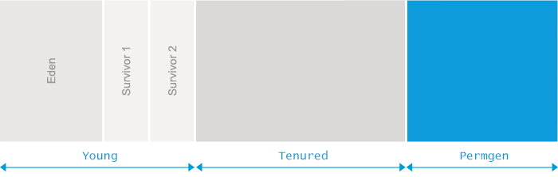

# java.lang.OutOfMemoryError: **Permgen space**

# OutOfMemoryError系列（3）: Permgen space

> **说明:** Permgen(永久代) 属于 JDK1.7 及之前版本的概念; 为了适应Java程序的发展, JDK8以后的版本采用限制更少的 MetaSpace 来代替, 详情请参考下一篇文章: [OutOfMemoryError系列（4）: Metaspace](./04_metaspace.md)。

Java applications are only allowed to use a limited amount of memory. The exact amount of memory your particular application can use is specified during application startup. To make things more complex, Java memory is separated into different regions which can be seen in the following figure:

每个Java程序都被限制了最大堆内存, 这种限制由JVM的启动参数决定。而且, Java将堆内存划分为多个区域, 如下图所示:





The size of all those regions, including the permgen area, is set during the JVM launch. If you do not set the sizes yourself, platform-specific defaults will be used.

这些区域的最大值, 由JVM启动参数 `-Xmx` 和 `-XX:MaxPermSize` 指定. 如果没有明确指定, 则根据操作系统平台和物理内存的大小来确定。

The _java.lang.OutOfMemoryError: PermGen space_ message indicates that the **Permanent Generation’s area in memory is exhausted**.

_java.lang.OutOfMemoryError: PermGen space_ 错误信息所表达的意思是: **永久代(Permanent Generation) 内存区域已满** 

## What is causing it?

## 原因分析

To understand the cause for the _java.lang.OutOfMemoryError: PermGen space_, we would need to understand what this specific memory area is used for.

要了解 _java.lang.OutOfMemoryError: PermGen space_ 产生的原因, 我们先来看看 **PermGen** 是用来干什么的。

For practical purposes, the permanent generation consists mostly of class declarations loaded and stored into PermGen. This includes the name and fields of the class, methods with the method bytecode, constant pool information, object arrays and type arrays associated with a class and Just In Time compiler optimizations.

【JDK1.7及之前版本】实际上, 永久代(permanent generation) 主要由加载/缓存的 class 定义所构成, 包括 class 的 名称(name), 以及字段(fields), 方法(methods)还有字节码(method bytecode); 常量池(constant pool information); 对象数组(object arrays)/类型数组(type arrays)所关联的 class, 还有 JIT 编译器优化后的class等。

From the above definition you can deduce that the PermGen size requirements depend both on the number of classes loaded as well as the size of such class declarations. Therefore we can say that **the main cause for the _java.lang.OutOfMemoryError: PermGen space_ is that either too many classes or too big classes are loaded to the permanent generation**.

由此可知, PermGen 的使用量, 与 JVM 加载到内存中的 class 的数量/尺寸有关。 可以说, 造成 _java.lang.OutOfMemoryError: PermGen space_ 错误的主要原因, 是加载到内存中的 class 数量太多或者体积太大。


## Give me an example

## 示例

### Minimalistic example

### 最简单的例子

As we described above, PermGen space usage is strongly correlated with the number of classes loaded into the JVM. The following code serves as the most straightforward example:

我们知道, PermGen 空间的使用量, 与JVM加载的 class 数量有很大关系。下面的代码直接创建了很多class:


```
import javassist.ClassPool;

public class MicroGenerator {
  public static void main(String[] args) throws Exception {
    for (int i = 0; i < 100_000_000; i++) {
      generate("eu.plumbr.demo.Generated" + i);
    }
  }

  public static Class generate(String name) throws Exception {
    ClassPool pool = ClassPool.getDefault();
    return pool.makeClass(name).toClass();
  }
}
```

In this example the source code iterates over a loop and generates classes at runtime. Class generation complexity is being taken care of by the [javassist](http://www.csg.ci.i.u-tokyo.ac.jp/~chiba/javassist/) library.

这段代码通过 for 循环, 在执行过程中, 动态生成了很多class。可以看到, 这里使用 [javassist](http://www.csg.ci.i.u-tokyo.ac.jp/~chiba/javassist/) 库生成 class 是非常简单的。

Launching the code above will keep generating new classes and loading their definitions into Permgen space until the space is fully utilized and the _java.lang.OutOfMemoryError: Permgen space_ is thrown.

生成很多新 class 并加载到JVM, 然后将会占满Permgen空间, 抛出 _java.lang.OutOfMemoryError: Permgen space_ 错误, 当然, 也有可能会抛出其他类型的 OutOfMemoryError。

为了快速看到效果, 可以加上适当的JVM启动参数, 如: `-Xmx200M -XX:MaxPermSize=16M ` 之类的参数。


### Redeploy-time example

### Redeploy 时产生的 OutOfMemoryError

> **说明：** 如果在开发时Tomcat产生警告，可以忽略。 生产环境建议不要 redploy,直接关闭/或Kill相关的JVM，然后从头开始启动即可。

For a bit more complex and more realistic example, lets walk you through a _java.lang.OutOfMemoryError: Permgen space_ error occurring during the application redeploy. When you redeploy an application, you would expect that [Garbage Collection](https://plumbr.eu/handbook/garbage-collection-algorithms-implementations) will get rid of the previous classloader referencing all the previously loaded classes and it gets replaced with a classloader loading new versions of the classes.

下面的情形更常见,在重新部署web应用时, 很可能会引起 _java.lang.OutOfMemoryError: Permgen space_ 错误. 按道理说, redeploy 时, Tomcat之类的容器会使用新的 classloader 来加载新的 class, 让[垃圾收集器](http://blog.csdn.net/renfufei/article/details/54885190) 将之前的 classloader (连同加载的class一起)清理掉,。

Unfortunately many 3rd party libraries and poor handling of resources such as threads, JDBC drivers or filesystem handles makes unloading the previously used classloader impossible. This in turn means that **during each redeploy all the previous versions of your classes will still reside in PermGen generating tens of megabytes of garbage during each redeploy**.

但实际情况可能并不乐观, 很多第三方库, 以及某些受限的共享资源, 如 thread, JDBC驱动, 以及文件系统句柄(handles), 都会导致不能彻底卸载之前的 classloader. 那么在 redeploy 时, 之前的class仍然驻留在PermGen中, **每次重新部署都会产生几十MB，甚至上百MB的垃圾**。

Let’s imagine an example application that connects to a relational database using JDBC drivers. When the application is started, the initializing code loads the JDBC driver to connect to the database. Corresponding to the specification, the JDBC driver registers itself with _java.sql.DriverManager_. This registration includes storing a reference to an instance of the driver inside a static field of _DriverManager_.

假设某个应用在启动时, 通过初始化代码加载JDBC驱动连接数据库. 根据JDBC规范, 驱动会将自身注册到 _java.sql.DriverManager_, 也就是将自身的一个实例(instance) 添加到 _DriverManager_ 中的一个 static 域。

Now, when the application is undeployed from the application server, _java.sql.DriverManager_ will still hold that reference. We end up having a live reference to the driver class which in turn holds reference to the instance of _java.lang.Classloader_ used to load the application. This in turn means that the [Garbage Collection Algorithms](https://plumbr.eu/handbook/garbage-collection-algorithms-implementations) are not able to reclaim the space.

那么, 当应用从容器中卸载时, _java.sql.DriverManager_ 依然持有 JDBC实例(Tomcat经常会发出警告), 而JDBC驱动实例又持有 _java.lang.Classloader_ 实例, 那么 [垃圾收集器](http://blog.csdn.net/renfufei/article/details/54885190) 也就没办法回收对应的内存空间。

And that instance of **_java.lang.ClassLoader_ still references all classes of the application, usually occupying tens of megabytes in PermGen**. Which means that it would take just a handful of redeploys to fill a typically sized PermGen and get the _java.lang.OutOfMemoryError: PermGen space_ error message in your logs.

而 _java.lang.ClassLoader_ 实例持有着其加载的所有 class, 通常是几十/上百 MB的内存。可以看到, redeploy时会占用另一块差不多大小的 PermGen 空间, 多次 redeploy 之后, 就会造成 _java.lang.OutOfMemoryError: PermGen space_ 错误, 在日志文件中, 你应该会看到相关的错误信息。


## What is the solution?

## 解决方案

### **1.** Solving initialization-time OutOfMemoryError

### **1.** 解决程序启动时产生的 OutOfMemoryError

When the OutOfMemoryError due to PermGen exhaustion is triggered during the application launch, the solution is simple. The application just needs more room to load all the classes to the PermGen area so we just need to increase its size. To do so, alter your application launch configuration and add (or increase if present) the _-XX:MaxPermSize_ parameter similar to the following example:

在程序启动时, 如果 PermGen 耗尽而产生 OutOfMemoryError 错误, 那很容易解决.  增加 PermGen 的大小, 让程序拥有更多的内存来加载 class 即可. 修改  _-XX:MaxPermSize_  启动参数, 类似下面这样:

```
java -XX:MaxPermSize=512m com.yourcompany.YourClass

```


The above configuration will tell the JVM that PermGen is allowed to grow up to 512MB before it can start complaining in the form of OutOfMemoryError.

以上配置允许JVM使用的最大 PermGen 空间为 `512MB`, 如果还不够, 就会抛出 _OutOfMemoryError_。


### **2.** Solving redeploy-time OutOfMemoryError

### **2.** 解决 redeploy 时产生的 OutOfMemoryError


For those who cannot use Plumbr or decide not to, alternatives are also available. For this, you should proceed with heap dump analysis – take the heap dump after a redeploy with a command similar to this one:

我们可以进行堆转储分析(heap dump analysis) —— 在 redeploy 之后, 执行堆转储, 类似下面的命令:


```
jmap -dump:format=b,file=dump.hprof <process-id>

```


Then open the dump with your favourite heap dump analyzer (Eclipse MAT is a good tool for that). In the analyzer, you can look for duplicate classes, especially those loading your application classes. From there, you need to progress to all classloaders to find the currently active classloader.

然后通过堆转储分析器(如强悍的 Eclipse MAT)加载 heap dump。通过分析器找到重复的类, 特别是加载 class 的那些类. 一般来说, 你需要对比所有的 classloader, 以找到当前使用的classloader(类加载器)。

> Eclipse MAT 在各个平台都有独立安装包.  大约50MB左右, 通过官网下载即可。


For the inactive classloaders, you need to determine the reference blocking them from being [Garbage Collected](https://plumbr.eu/handbook/garbage-collection-in-jvm) via harvesting the shortest path to [GC root](https://plumbr.eu/handbook/garbage-collection-algorithms/marking-reachable-objects) from the inactive classloaders. Equipped with this information you will have found the root cause. In case the root cause was in a 3rd party library, you can proceed to Google/StackOverflow to see if this is a known issue to get a patch/workaround. If this was your own code, you need to get rid of the offending reference.

对于不使用的 classloader, 您需要确定是哪个最短路径的 [GC root](http://blog.csdn.net/renfufei/article/details/54407417#t0) 在阻止他们被 [垃圾收集](http://blog.csdn.net/renfufei/article/details/54144385) 回收. 了解这些信息之后, 就可以找到问题的根源. 如果是第三方库的原因, 那么可以通过 Google/StackOverflow 来查找解决方案. 如果是自己的代码问题, 则需要在适当的时机解除相关引用。


### **3.** Solving run-time OutOfMemoryError

### **3.** 解决运行时产生的 OutOfMemoryError


An alternative way for those once again who cannot use Plumbr is also available. First step in such case is to check whether the [GC is allowed to unload classes from PermGen](https://plumbr.eu/handbook/garbage-collection-in-jvm/memory-pools/permgen). The standard JVM is rather conservative in this regard – classes are born to live forever. So once loaded, classes stay in memory even if no code is using them anymore. This can become a problem when the application creates lots of classes dynamically and the generated classes are not needed for longer periods. In such a case, allowing the JVM to unload class definitions can be helpful. This can be achieved by adding just one configuration parameter to your startup scripts:

这种情况下, 首先确认 [GC是否能从PermGen中卸载class](http://blog.csdn.net/renfufei/article/details/54144385#t6)。 标准JVM在这方面是相当保守的(class加载之后,就一直驻留在内存中,即使不再使用). 但是, 现在的程序在运行过程中, 会动态创建大量的class, 而生成的这些class生命周期大多又很短, 旧版本的JVM就不能很好地应对这些问题。这时候允许JVM卸载class是很有用的。这可以通过一个启动参数类指定, 如下所示:

```
-XX:+CMSClassUnloadingEnabled

```


By default this is set to false and so to enable this you need to explicitly set the following option in Java options. If you enable _CMSClassUnloadingEnabled_, [GC will sweep](https://plumbr.eu/handbook/garbage-collection-algorithms/removing-unused-objects/sweep) PermGen too and remove classes which are no longer used. Keep in mind that this option will work only when _UseConcMarkSweepGC_ is also enabled using the below option. So when running [ParallelGC](https://plumbr.eu/handbook/garbage-collection-algorithms-implementations/parallel-gc) or, God forbid, [Serial GC](https://plumbr.eu/handbook/garbage-collection-algorithms-implementations/serial-gc), make sure you have set your GC to [CMS](https://plumbr.eu/handbook/garbage-collection-algorithms-implementations/concurrent-mark-and-sweep) by specifying:

_CMSClassUnloadingEnabled_ 配置默认值为`false`, 所以需要显式指定。 启用之后, [GC will sweep](https://plumbr.eu/handbook/garbage-collection-algorithms/removing-unused-objects/sweep) PermGen, 卸载不再使用的 class. 当然, 这个选项只在设置 _UseConcMarkSweepGC_ 时才有用。 如果使用了 [ParallelGC](https://plumbr.eu/handbook/garbage-collection-algorithms-implementations/parallel-gc), 或者 [Serial GC](https://plumbr.eu/handbook/garbage-collection-algorithms-implementations/serial-gc) 时, 那么需要通过以下参数指定  [CMS](https://plumbr.eu/handbook/garbage-collection-algorithms-implementations/concurrent-mark-and-sweep):

```
-XX:+UseConcMarkSweepGC
```


After making sure classes can be unloaded and the issue still persists, you should proceed with heap dump analysis – taking the heap dump with a command similar to following:

确保 class 可以卸载的情况下, 如果还存在 OutOfMemoryError, 那就应该执行堆转储分析了, 类似这种格式:

```
jmap -dump:file=dump.hprof,format=b <process-id> 

```


Then opening the dump with your favorite heap dump analyzer (e.g. Eclipse MAT) and progressing to find the most expensive classloaders by the number of classes loaded. From such classloaders, you can proceed to extract the loaded classes and sort such classes by the instances to have the top list of suspects.


然后通过你熟悉的堆转储分析器(如 Eclipse MAT) 加载 heap dump。通过分析器找到最重的 classloader, 也就是加载的 class 数量最多的那种.  通过加载的 class ,以及对应的实例数量, 比对类加载器, 找出最靠前的那些进行分析。


For each suspect, you then need to manually trace the root cause back to your application code that generates such classes.

对于每个有嫌疑的类, 都可以手动跟踪到生成这些类的代码中, 以定位问题。


链接: [跟OOM：Permgen说再见吧](http://www.importnew.com/14933.html)

原文链接: <https://plumbr.eu/outofmemoryerror/permgen-space>

